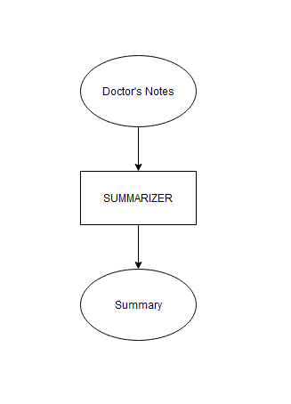
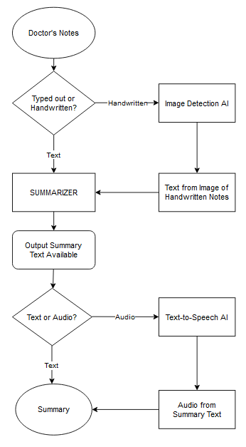

# Doctor's Note Summarizer

This project summarizes a doctor's note in a way that is easy for the patient to understand.

> See this project in action on Streamlit! Click here: https://doctors-note-summarizer.streamlit.app/

## Project and Work Product Description:

A doctor or other healthcare provider may write a note to describe a healthcare visit, telephone call, or other patient interaction. The problem is that the doctor's report is often full of medical terminology and procedural shorthand that is too complex for most patients to understand. Our goal is to make a doctor's note more accessible for their patient to comprehend.

| The Project As-Is: | The Project To-Be: |
| --------------- | --------------- |
|  |  |
| **File Format:** Input any text. Output a summary and save it as a text file (.txt). | **File Format:** Input text and images of a doctor's handwritten notes. Output simplified English text with voice audio option |
| **Features:** Uses Natural Language Toolkit (NLTK) library to preprocess the text (e.g., tokenization, stemming, removing stop words) | **Features:** Use NLTK to preprocess the text, and TensorFlow/Keras to generate the summary from PubMed dataset. The PubMed dataset contains medical articles and their abstracts, which can be used as summaries |

## Description of Solution: 

We use artificial intelligence (AI) and the Python programming language to simplify a doctor's note in layman's terms. Our vision is that all patients with various levels of education, class, and abilities (sight, hearing, etc) can better understand and access their doctor's note with the help of technology as a translator.

* Workflow Diagram

  

* Minimum Viable Product (MVP) 1.0 delivered:
In the completed version 1.0 of this project:
  1) Code has been developed to input a doctor's note, as a .txt fle
  2) A fake doctor's notes generated by ChatGPT can be successfully selected to be parsed
  3) Output a summary.txt file

* Later MVP, i.e., v2, v3, vN+ functionality to be delivered
For future enhancements, in the next versions of this project:
  * Version 1.1: Clean up Technical Debt
    * Inform the user that .txt files are the only file type accepted
    * Cleanup Code - remove code references to a deprecated feature (we are no longer accepting .docx and .xlsx file input)
    * Fine-tune output files
    * Create output files with DATETIME
    * Improved Text Formatting: Updated the write_to_txt function in Doc_Rpt_Writer.py to improve the formatting of the output text. The function now correctly handles abbreviations like "Ms." and does not break the line after them. This was achieved by using the nltk.tokenize.sent_tokenize function to split the summary into sentences.
    * Removed Leading Spaces: Modified the write_to_txt function to remove any leading spaces from the summary.
    * Updated Header Formatting: Adjusted the formatting of the headers in the summary. The values of the headers "Patient Name", "Date of Birth", and "Date of Consultation" are now on the same line as the headers themselves, rather than on a new line.
    * Created Summary Reports Directory: Updated the write_to_txt function to create a directory named 'summary-reports' if it does not already exist. This is where the function saves the formatted summary reports.
    * Inform the user to provide more information about what the app does. The app reads in a patient's medical report and writes it into a more easily readable format, without the heavy technical medical or health-related terminologies.

  * Version 2.0: Quality Assurance
    * QA the Input files - input makes sense (Sample_Report files)
    * QA the Output file - Make sure the AI returned good data (actual easy English summary of doctor's note)
  * Version 3.0: Read handwriting images
  * Version 4.0: Output voice audio
  * Version 5.0: Doctor's Note to MRI person or other nurses

## Solution Design (high-level):

This project uses nltk, and streamlit libraries to generate, process, and summarize a doctor's note

## Solution Code Description (low-level design): 

1. **Downloads necessary NLTK data**: The script uses the nltk library to download the 'punkt' and 'stopwords' 
datasets, which are used for tokenizing text and filtering out common words, respectively.
2. **Summarizes reports**: The script includes a function to summarize a report. This function tokenizes the 
text, filters out common words, and identifies the most important sentences to include in the summary.
3. **Writes summaries to files**: The script includes functions to write the summaries to text files
4. **Creates a Streamlit app**: The script uses Streamlit to create a web app. The app reads the report, generates a summary, and 
writes the summary to a .txt file

## Actual Working Product Code: 

* The code is available to the public here on this GitHub Repository. 
* The required packages are:
  * nltk
  * streamlit
  * tensorflow (this includes keras and requires python 3.6 to 3.9)
> See this project in action on Streamlit! Click here: https://doctors-note-summarizer.streamlit.app/

## Application Instructions:

Here are the step-by-step instructions to install, set up, and use this project:

1. Download and install these software tools:
  * Anaconda Navigator
  * Visual Studio Code
2. Clone the repository
3. Run these commands in the Visual Studio Code terminal:
  * To create the conda virtual environment and install required Python packages:
> conda create -n doctors_note_env -c conda-forge nltk streamlit python=3.9.17 tensorflow
  * On Windows, to switch into the created environment where all the packages were installed
> activate doctors_note_env
  * On Mac, to switch into the created environment where all the packages were installed
> source activate doctors_note_env
4. Run the project
> streamlit run main.py
